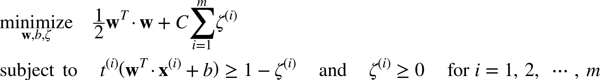

# Lecture 10: Support Vector Machines, Hyperparameter Tuning and Model Evaluation

- **Support Vector Machine (SVMs)**
    - SVMs are an extremely powerful and versitle model capable of performing classification, regression, and outliar detection
        - It can also perform on both linear and non-linear tasks
    - **SVM functionality**
        - SVM classficiation works by trying to find the line of best fit with largest margin of seperation between two classes. This type of classfication is called **large margin classification**
        - The edge of the largest margins separating the two classes are called the **support vectors**. **Support vectors** define the classification edge of the classes and is represented as a vector of weights.
            - These support vectors line up closest the fringe data points in the training set. As such it is said that Support Vector Machines really only cares about the instances the two classes that are close to the 
        - **How do we train a SVM?**
            - The training objectives for a SVM is to minimize the absolute value of the support vectors. By doing this SVM maximizes the margin between the two classes in question for the line of best fit.
            - **Slack variables** are SVM hyperparameters that allow use to determine how much give/tolerance the SVM model has for outliers. The higher the **slack variable** the greater the outlier tolerance is.  
            - **Training Formula:**
            

        - **How does SVM actually perform classification**
            - SVM perform classification by computing the dot product of support vectors and how data plus bias.
                - if w^T * w + b < 0 then 0 is returned
                - if w^T * w + b >= 0 then 1 is returned
            - Some important information to understand the above equation:
                - 0 is were the hyperplane intersects the dataset SVM is working on.
                - 1 or -1 is when the value is at or past the support vector for a class.

- **Hyperparameter Tuning**
    - **What are Hyperparamters?**
        - Hyperparameters are parameters which define the model architecture. 
            - For example, the hyperparamters for an SVMs model is:
                - the kernel of choice
                - slack variables 
        
        - By changing these parameters you will change the fundamental behavior a model will have when training on data.
        - As such hyperparameters can not be estimated from your dataset they have be pre-specified before training.
        - The process of identifying the optimal hyperparameters for a given model is commonly referred to as **Hyperparameter Tuning**
    - **Methods of Hyperparameter Tuning**
        - **GridSearch**
            - Gridsearch is the simplest method of hyperparameter tuning.
            - **GridSearch Methodology:** 
                1. proved for all hyperparameters of interest list of possible hyperparameter value you wish to experiment. 
                2. Iterate through evey possible combination of the hyperparameters of interest build and evaluate a model.
                3. Then select the model that produces the best results and it's hyperparameter.
            - Because of how GridSearch searches a potiential hyperparameter space it is consider and exhaustive method and is rather computational inefficient.
        - **RandomSearch**
            - The theoritical underpinning of RandomSearch is that for most datasets only a few of the hyperparameters really matter, but that hyperparameters are important on different datasets.
            - **RandomSearch Method**
                1. Provide a statistical distributions for every hyperparameter of interest
                2. Define how my N iterations RandomSearch will perform
                3. For i in N iterations draw a sample for the statistical distributions provided.
                4. With i sample build a model and evaluate performance.
                5. Upon completing N iterations select the best performing model and hyperparameters.
            - RandomSearch improves the exploratory power and can focus on finding the optimal value for the important hyperparameter
        
        - **Bayesian Optimization**
            - In the previous 2 methods experiment where performed in isolation, we're not able to use the information from one experiment to improve the next experiment
            -  Bayesian optimization allows us to use the results of our previous iteration to improve our sampling method of the next experiment
            - **Bayesian Optimization Method**
                1. Define a model constructed with hyperparameters λ
                2. Train the model and evaulate according to some evaluation metric scored v
                3. Use the previously evaluated hyperparameter values to compute a posterior expectation of the hyperparameter space. 
                4. Choose the optimal hyperparameter values according to this posterior expectation as our next model candidate. We 
                5. iteratively repeat this process until converging to an optimum.

- **Model Evaluation Methods**
    -