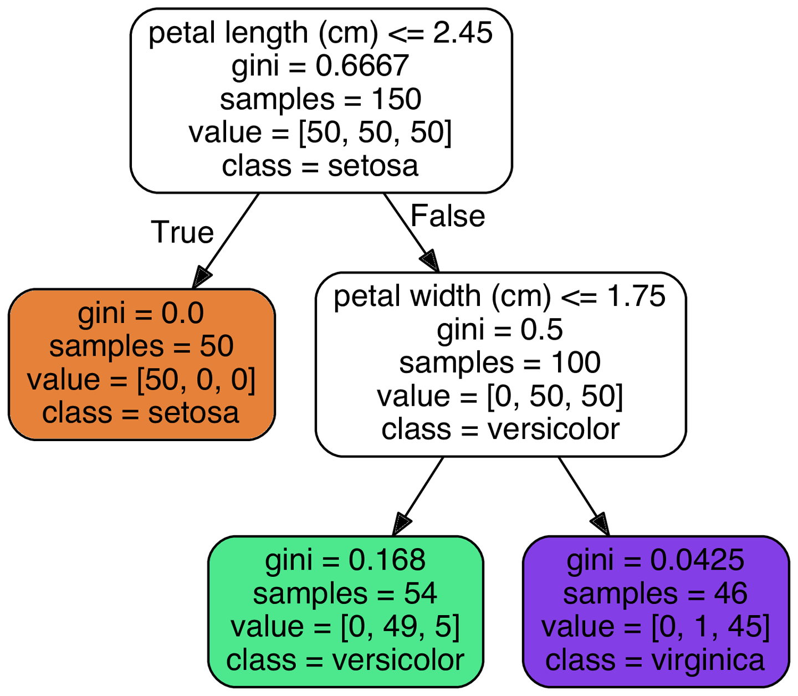
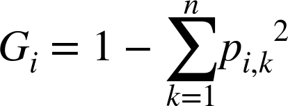
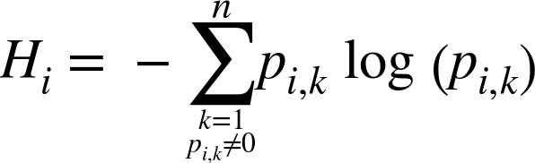
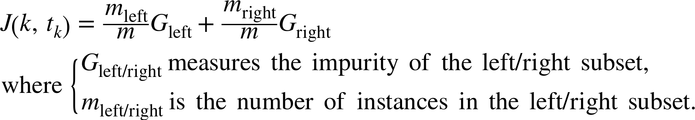

# Lecture 11: Decision Tree and Random Forests

- **Decision Tree**
    - Decision Tree's is an extremely verastile ML algorithm that can perform both classification and regression. There capable of fitting complex linear or nonlinear datasets. Additionally, Decision Tree's are extremely easy to interupt. However, they are prone to overfitting.
    - Decision Tree learn there strcuture one node at a time. For each node in a tree a one parameter is queryed and a cutoff threshold that minimizes the nodes impurity.
    - A node is condisdered pure if all training instances it applies to comes from one class.
    
    - **Measuring Impurity**
        - There are two ways of calculating the impurity measure of a node:
            - gini index:
                
                - gini index is faster than entropy 
                - additionally, it trends to isolate most frequent class to there own tree branches
            - entropy:
                
                - when entropy is zero it contains only one class. when its one it contains equal number at classes max disorder
   
    - Scikit-Learn uses the Decision Tree Algorithm **Classification And Regression Tree (CART) Algorithm**. CART is a greedy algorithm. As such it will provide a generally reasonable results. But it will not provide the "optimal" position.
    - **CARTs Algorithm:**
        1. Split the training set into two subsets using a single feature from k and a threshold tk. This create a simple yes/no question.
        2. CART searches for the purest (k, tk) pair weighted by the size.
        3. Once CART identifies the purest pair weight is found. This process is repeated for every yes node of the Decision Tree until the max depth was reached.
    - The CARTs Algorithm optimization equation is:
        
    - **CART hyperparameters:**
        - min_samples_split: minimium number of samples a node must have before splitting.
        - min_samples_leaf: minimium number of samples a leaf node must have
        - min_weight_fraction_leaf: same as min_samples_leaf but expressed as a fraction of the total number of weighted instances
        - max_leaf_node: maximium number of leaf nodes
        - max_features: maximium number of features that are evaluated for splitting at each node.
        - max_depth: maximium depth of a Decision Tree
    - Computational speaking the CART algorithm is extremely efficient predictions taking O(log2(m)) and training only takes O(n * m * log(m))

- **Ensemble Methods**
    - Ensemble methods are based off of the hypothesis of wisdom of the crowd. The idea is if you average the knowledge of the crowd you'll be get a better answer than asking a single individual.
        - That is if you aggregate the predictors into of an aggregated group of predictors, you will get a better predictions.
    - How does ensemble methods make predictions? Typically, by majority vote. Every predictor used in the ensemble method gets a vote.
        - With the majority vote becoming the predictions of an ensemble method. This 
    - There are 3 methods of ensemble learning: 
        - bagging (will cover)
        - boosting (read)
        - stacking (read)
    
    - **Bootstarp aggregating (Bagging)**
        - One way of training ensemble method is to use the same training algorithm for every predictor in the ensemble, but you train each of these predictors with a slightly different random subset of the training dataset (**Recommended**)
        - How do you create different random subsets of training data from a given dataset?
            - Through using the **bootstrap** sampling method.
            - **Bootstrap** sampling method generates a data subsets by random sampling with replacement from a given dataset.
            - For each one of these training subsets generated by bootstrap is then used to train an individual predictor.
        - This method of training individual predictors with individual subsets of a training dataset is called **bootstrap aggregating** or **bagging** for short.
        - In this method each individual predictor in the group is extremely bias however when all of the predictors are aggregated we observe the reduction of bias and variance.

    - **Random Forest**
        - The Random Forest Algorithm expands and builds upon the idea of bagging.
            - Fundamentally, ensemble training method of bagging is to introduce randomness into the training process by training predictors on subsects of training data. 
            - The Random Forest algorithm introduces extra randomness when growing trees; instead of searching for the very best feature when splitting a node, it searches for the best feature among a random subset of features.
            - Additionally, when training a Random Forest tree's in the forest are allowed to fully grow out and are not pruned.
        - By introducing this second level of randomness into the training process allows for a wider search of a given feature space
        - A Random Forest shares all of the hyperparameter of a Decision Tree. In addition, to these hyperparameter you can specify the number of tree's in the forest and number of data features exposed to an individual decision tree in the forest.

        - Error in Random Forest:
            - Correlations between tree's can randomly form
            - strength of a single 
            - increasing the number of features for each split will results in increasing correlation and increases the strength of a given
            single tree 
        - random forests in Scikit-Learn come with the following: out of the bag, feature importance measure, and proximite estimation.