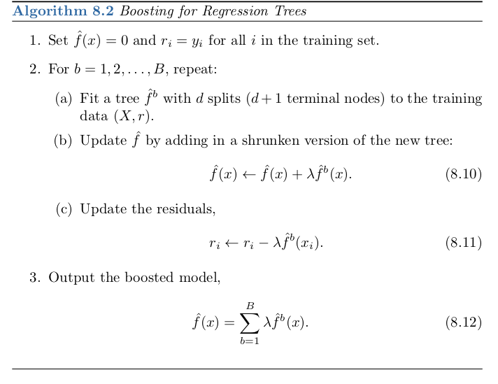

# Lecture 12: Boosting an Ensemble Learning Method

- **Boosting**
    - Boosting is an ensemble method that can combine several weak learners into a strong learner.
        - this is achieved by training predictors sequintially, each trying to correct there predicessors.
        - each predictor is trained using information from previously trained predictors.
    - The main boosting methods are:
        1. Adaptive Boosting aka Adaboost (Lecture and Notes focuse on adaboost)
        2. Gradient Boosting

- **AdaBoost**
    - Adaboost trains predictors to current predecessor predictors by having the current predictor pay more attention to training instances that the predecessor predictors underfitted
        - What this effectively means that new predictors will continue focus more and more on harder cases
        - Adaboost is algorithm is a **slow learning**. Slow learning algorithms work by taking the error of a given model and training the next predictor to these errors. Thereby, slowing improve the models performance over time.
    - This focusing of new predictors on misclassified training instances by assigning weights to all of the training instances
    - At the start of model training all training instance are assigned and weight of equal value and as a training instance is misclassifed it's assigned weight is increased
    - As training continues training instances with large weights becomes the primary focus of what a new predictor is trying to predict. Thereby improving the overall predictive power of the model
    
    - **Adaboost Hyperparameters**
        1. The number of trees B. Unlike bagging and random forests, boosting can overfit if B is too large, although this overfitting tends to occur slowly if at all. We use cross-validation to select B.
        2. The shrinkage parameter λ, a small positive number.Thiscontrolsthe rate at which boosting learns. Typical values are 0.01 or 0.001, and the right choice can depend on the problem. Very small λ can require using a very large value of B in order to achieve good performance.
        3. The number d of splits in each tree, which controls the complexity of the boosted ensemble. Often d = 1 works well,in which case each tree is a stump, consisting of a single split. In this case, the boosted ensemble is fitting an additive model, since each term involves only a single variable. More generally d is the interaction depth, and controls the interaction order of the boosted model, since d splits can involve at most d variables.
    
    - **Adaboost Algorithm for Training Regressor**  
        
        - f(x) = model
        - ri = model error
        - All of the hyperparameters of adaboost have the same variables.

    
        