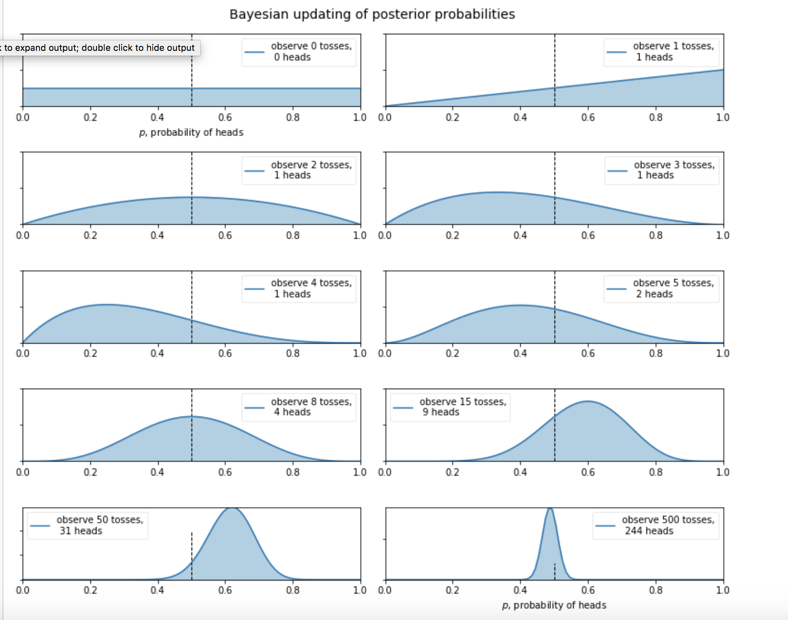

# Lecture 16: Bayesian Methods

- **Bayesian Methods: An Overview**
    - The fundamental core of Bayesian inference is to update your belief after considering new evidence.
    - **Differences between Frequentist and Bayesians:**
        1. **Interpretation of Probability:**
            - Frequentist interput probability as the long-run frequency of an event occuring. 
            - Bayesians interput proabability as the measure of belief/confidence of an eventing occuring. Essentially probability is the summary of opinions.
        2. **What functions return:**
            - Frequentists functions return estimates of a model parameter value
            - bayesian function return probabilities of a model parameter value
        3. **What are the Probabilities Bayesian Statistics work with:**
            - Prior Probabilities (P(A)) -> Our current belief of an event occurring
            - New Evidence (P(B)) -> belief of an event happening from the new data
            - Posterior Probabilities (P(A|B)) -> Updated belief of an event occuring after being exposed to new evidence
        4. **Where does Bayesian Statistics excel?**
            - Bayesian Statistics and Data Analysis tends to excel with small datasets.
            - Bayesian Statistics excels at small datasets because the prior probabilities and posterior probabilities preserve uncertainty in the data.
            - While, frequentists estimates are relatively unstable for a small n Dataset.
            - Typically, as N -> inifinity bayesian probabilities and frequentist estimates converge.
    - Fundametanlly, the Bayesian perspective can be summarized as the following: Upon observing data, evidence, or any other form of information you update your belief in the likelihood and event would happen. Thereby, making any new guess you make by definition less likely to be wrong.

- **Generative vs Discriminative Classifier:**
    - Generative and Discriminative classifier are categorization of classifiers from the bayesian perspective.
    - **Generative Classifiers**
        - a classifier that tries to learn the model that generates the  data behind the scenes by estimating the assumptions and distributions of the model. Then the model uses these estimates to predict unseen data.
        - **Bayesian Data Analysis can be idealized by dividing it into 3 steps:**
            1. Set up a full probability model - a join probability distribution for all observable and unobservable quantities in a problem.
            2. Conditionaly on observed data - calculating and interputating the appropiate posterior distribution - the conditional probability distribution of the unobserved quantities of ultimate interest, given the observed data.
            3. Evaluating the fit of the model and the implications of the resulting posterior distribution
    - **Discriminative Classifiers**
        - discriminative classifier tries to model by just depnding upon observered data. It makes fewer assumpations on distributions but depends heavily on the quality of data.
        - These are the other models
    - In practice, discriminative classifiers outperform generative classifiers, if you have a lot of data.

- **Bayesian Framework**
    - If bayesian statistics is interested in observing data, evidence, or any other form of information you update your belief in the likelihood and event would happen. **How do you update your belief?**
    - **Bayes Theorm** a mechanism of updating belief: 
        - P(A|X) = P(X|A) * P(A) / P(X)  
        
        - The figures above shows how bayesian inference works. as you observe events the posterior probability shifts to reflect the models current data
        - Eventually, you'll observe enough evidence that your posterior probabilities will begin to tighten

- **Naive Bayes Classification**
    - **Overview:**
        - Naive Bayes classifier assumes the presence of a particular feature in a class are unrelated to the presence of any other features.
        - Here's example of this assumption: for a given piece of fruit maybe considered to be an apple if it is red, round, and has a diameter of 3 inches. Even if these features were dependent upon each other, all of these properties independently contribute to the probability that this fruit is an apple and that is why it is known as ‘Naive’
        - Naive Bayes is easy to build and are particularly useful for very large datasets and typically outperforms sophisicated classification models.
    - **Naive Bayes Algorithm:**
        1. Convert the dataset into a frequency table
        2. Create likelihood table by finding the probabilities.
        3. Use bayes theorm's equation to calculate the posterior probabilities for each class. The class with the highest posterior probability is the outcome of the prediction.
    - **Pros**
        - Easy to develop and extremely fast at making predictions
        - when assumptions of independence holds this model will typically outperform most classifiers
        - perofrms well in with categorical features.
    - **Cons**
        - If categorical data has a category that was not present in the training data the model will not be able to predict it.
        - ANother limitation of this model is if the independent of assumpations of features doesn't hold
    - **Typical Applications**
        - Real time predictions: Naive Bayes is a eager learning classifier and is extremely fast at making predictions
        - Text Classification and Sentiment Analysis
        - Recommendation System: Naive Bayes Classifier and a collaborative filter put together buildsa recommendation system built upon the use of machine learning and data mining techniques to filter unseen information and predict whether a user would like a given resource or not.
    - **Naive Bayes Models**
        - **Gaussian:** These types of models are used for classificaiton and assumes that features follow a normal distribution. So if there are any numerical features not in a non-gaussian distribution will need to be transformed into a gaussian distribution.
        - **Multinominal:** Model is used for discrete counts. This type of model works great for text classification
        - **Bernoulli:** This binomial model works rally well on feature vectors that are binary. this could be used on bag of word models.

